## 操作系统基本原理   (上午题7分)

- 进程管理
- 存储管理
- 文件管理
- 作业管理  （考的少）
- 设备管理  （考的少）
- 微内核操作系统

### 进制管理
- 进制状态转换图

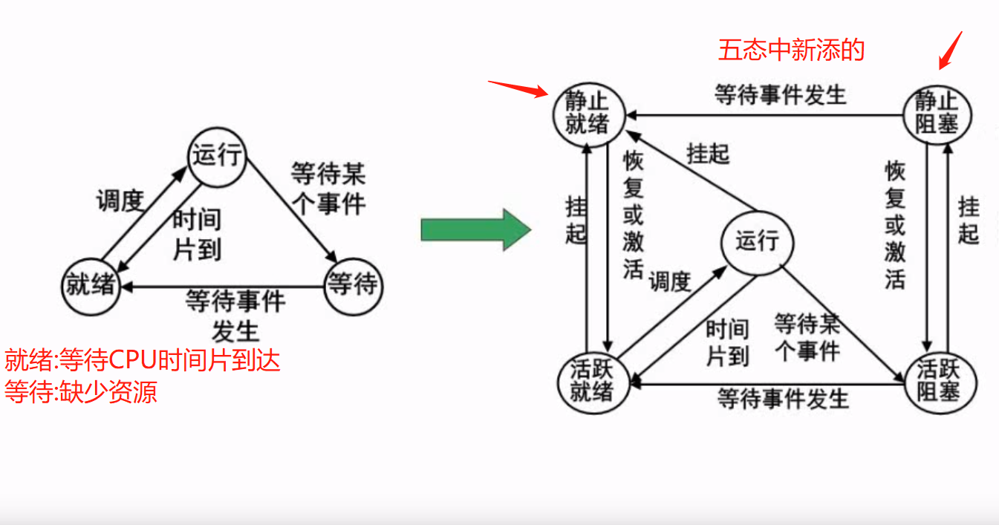

- 前趋图

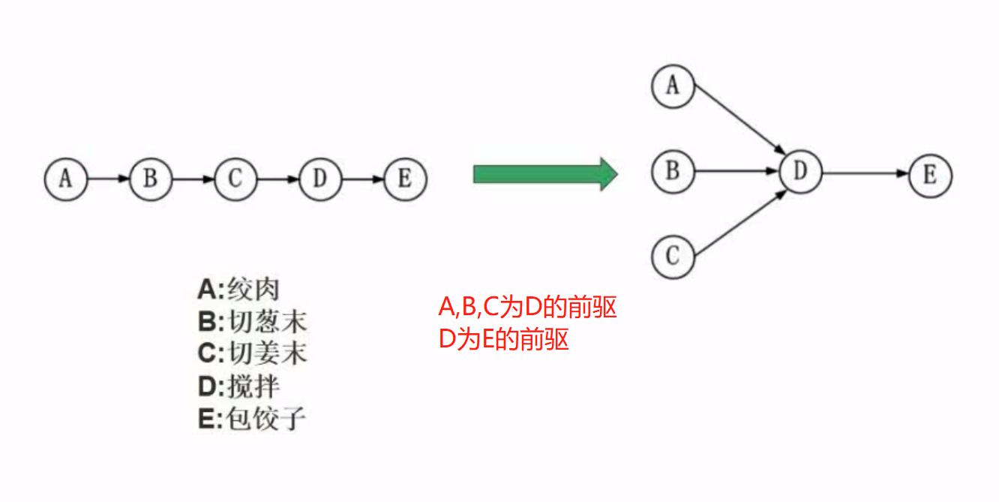

- PV操作


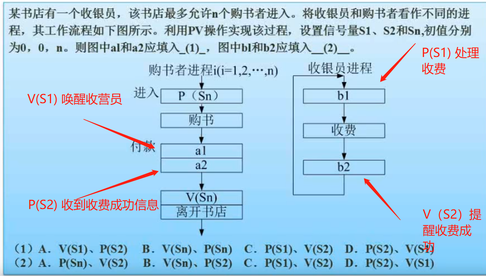

- PV操作-前趋图


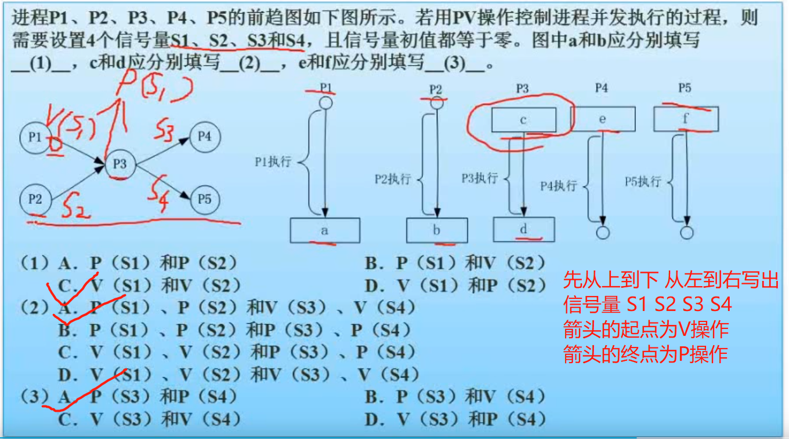

- 死锁

```
不用发生死锁的资源最小个数 = （每个进程需要的系统资源-1） * 进程数量 + 1
```
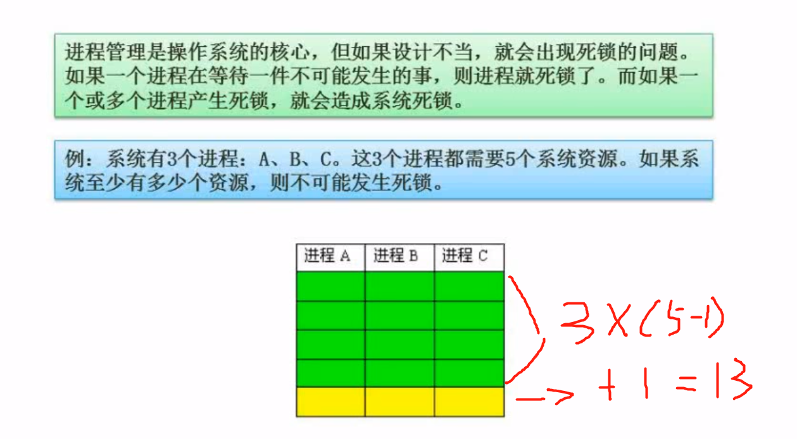

- 银行家算法


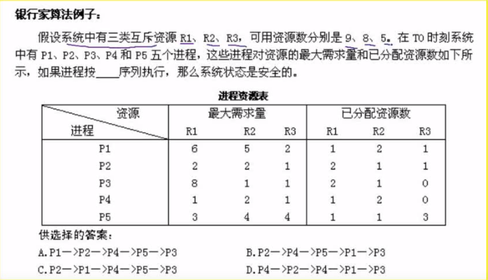

```
根据计算,图中剩余资源数为2,1,0. 各进程之间还需要的资源数下图表示
由图中可观察只有P2能满足分配,既首先分配给P2
当P2执行完毕回收资源,分配前已有的资源（2,1,0）加上P2占用的资源释放(2,1,1) = 当前能分配的资源（4,2,1）
继续寻找下一个能分配的进程,并回收进制占用的资源 直到所有进制分配完毕.形成安全序列
答案选B
```

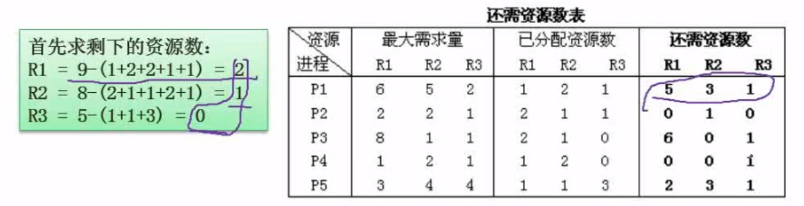

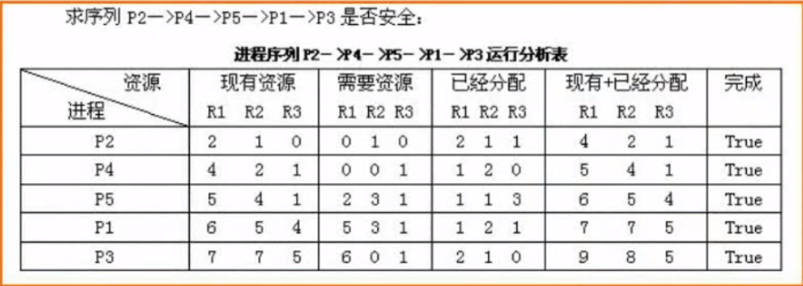

### 存储管理

- 分区存储组织

```
首次适应算法: 找到首个满足分配的空间便进行切割分配
最佳适应算法: 找到满足分配的空间且切割后剩余空间最小 缺点:空间被切割后剩余的小空间如果无法满足分配,产生的碎片过多
最差适应算法: 找到满足分配的空间且该空间在满足分配的空间中最大
循环首次适应算法: 从下一个位置找到首个满足分配的空间便进行切割分配,最尾连接最头

```

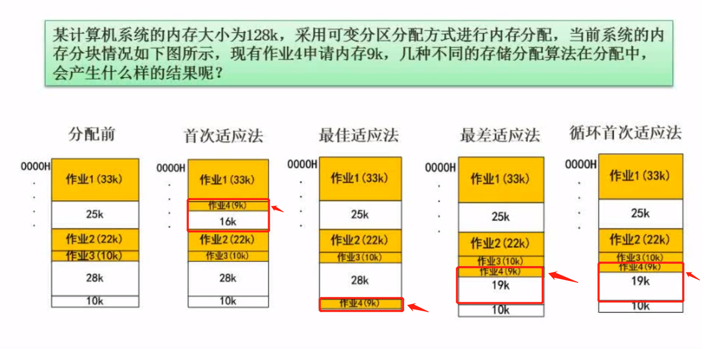

- 页式存储组织 (内存分页)

```
页式存储组织中逻辑地址转换为物理地址通过页表中的页号寻找块号,页内地址作为物理地址的后半部分,物理地址中前半部分需要通过页号得到块号.两者拼接得到物理地址

```

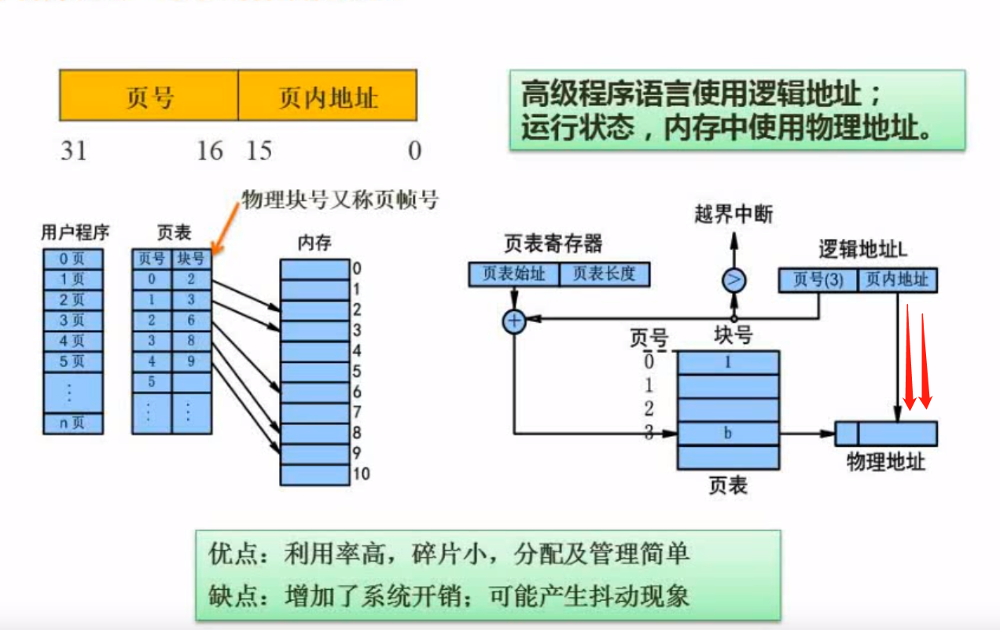

[页式存储组织题目](https://wenku.baidu.com/view/d5ae990753ea551810a6f524ccbff121dd36c5eb.html)

```
下图由题目可知:页面大小为4K 既2^12 = 4K。
由逻辑地址: 5A29H = 0101 1010 0010 1001 前4位 0101 为页号5, 后12位为页内地址,也为物理地址的后半部分

根据表中可知 页号5块号为6 既 物理地址为 0110 1010 0010 1001 = 6A29H

进制访的页面P4不为内存中.而系统只给进制分配4个存储块已经用完.则需要替换内存中的页面0,1,2,5 而0,2,5有使用过不能淘汰.则替换1号页面
```
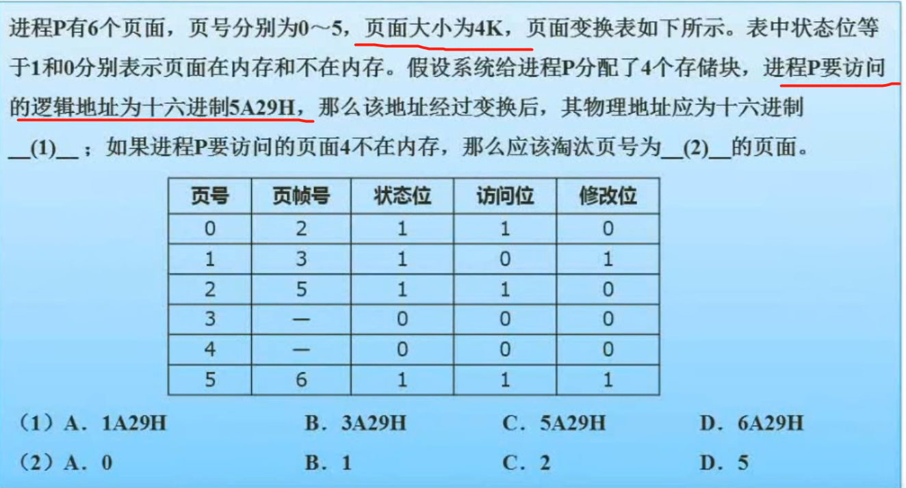


- 段式存储组织 (程序分段)

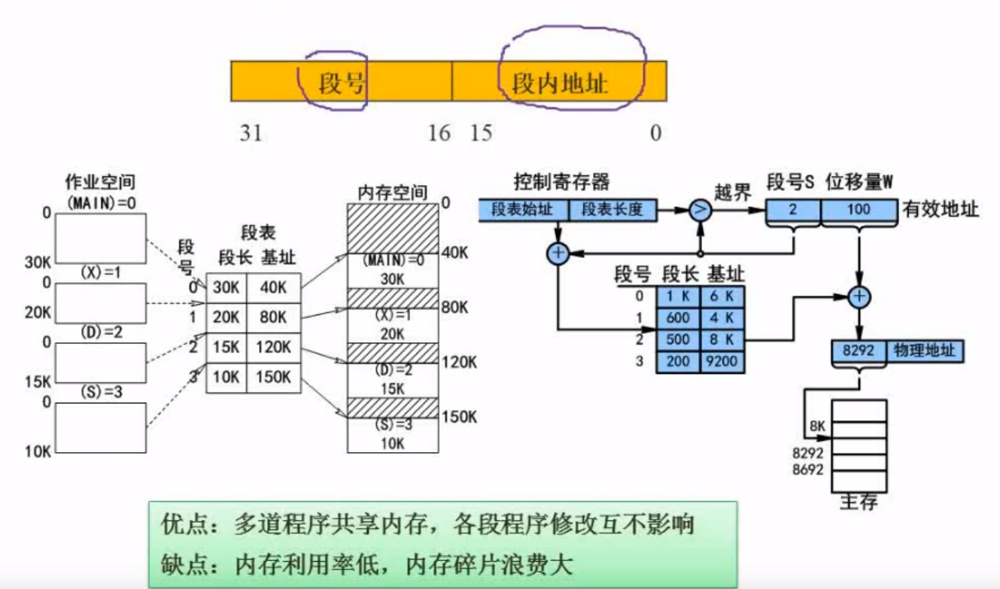


- 段页式存储组织

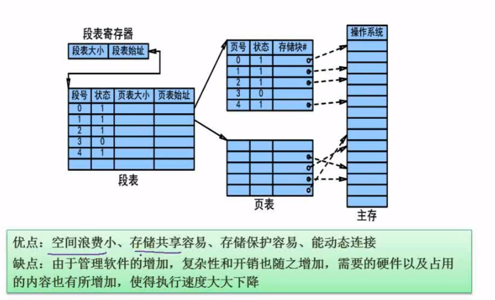

- 快表


### 页面置换算法

```
最优算法(OPT) 理论算法,无法实现4
随机算法(RAND)
先进先出算法(FIFO) 会发生抖动
最近最少使用算法(LRU) 不会发生抖动
抖动:指分配页面多的情况效率还不如分配页面少的情况
```

1. 先进先出算法

```
先进先出置换算法（first in first out,FIFO）是淘汰最先进入内存的页面，即选择在内存中驻留时间最长的页面进行淘汰的算法。
```

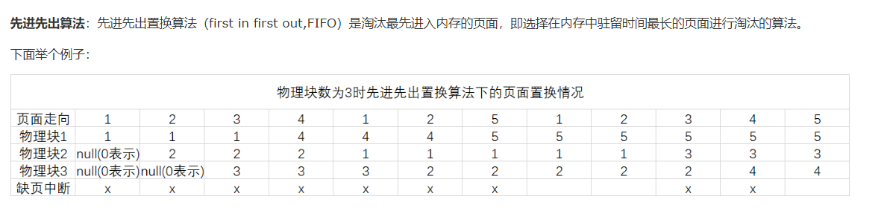

2. 最近最少使用算法

```
需要置换一页时，选择在最近的一段时间里最久没有使用的页面进行置换
```

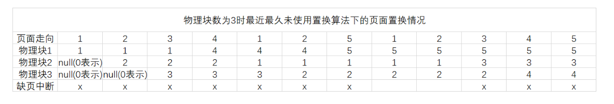

3. 页面置换例题

```
规则:页表存放在内存中.查询数据先要查找从页表中查找页号. 通过页号与逻辑地址去内存中查找数据  需要访问2次内存
     指令跨页只会产生一次中断,数据跨页则产生多次中断.

下图题中可知Swap指令占用6个页号,则需要访问12次内存.中断次数为1+2+2 = 5
```
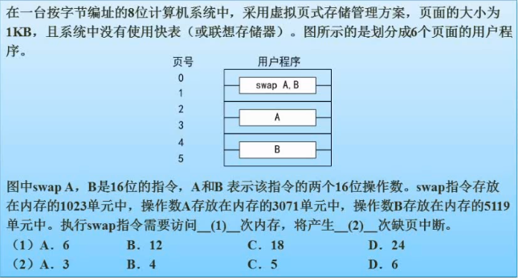


### 文件管理

- 索引管理


```
根据图中可知索引节点有8个 磁盘数据块大小为1K。则每个索引能容纳1024/8 =256。
既第58号物理块存放的是5,187号物理块存放的是(5 + 256) = 261
地址0-4为直接索引 5-6为一级索引 7为二级索引
```
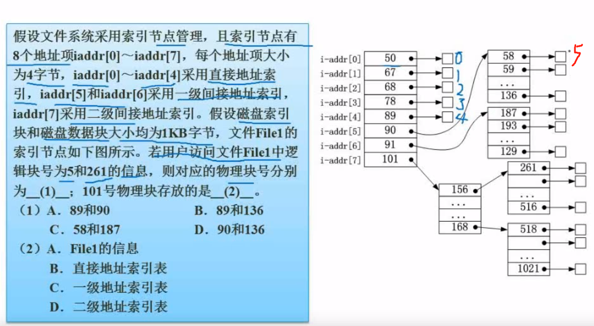

- 文件和树型目录结构

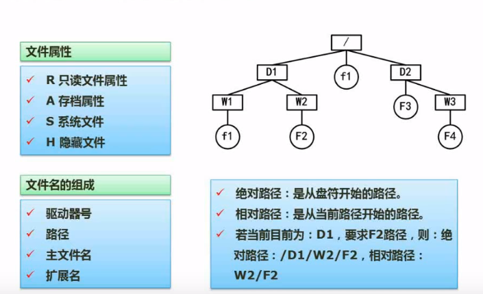

- 空闲存储空间的管理

```
空闲区表法(空闲文件目录) 用一个表记录空闲区域
空闲链表法 用链表的方式把空闲空间记录下来
位示图法 把存储空间划分为很多物理块 用01表示存储情况
成组链表法 用块与链表记录空闲区
```
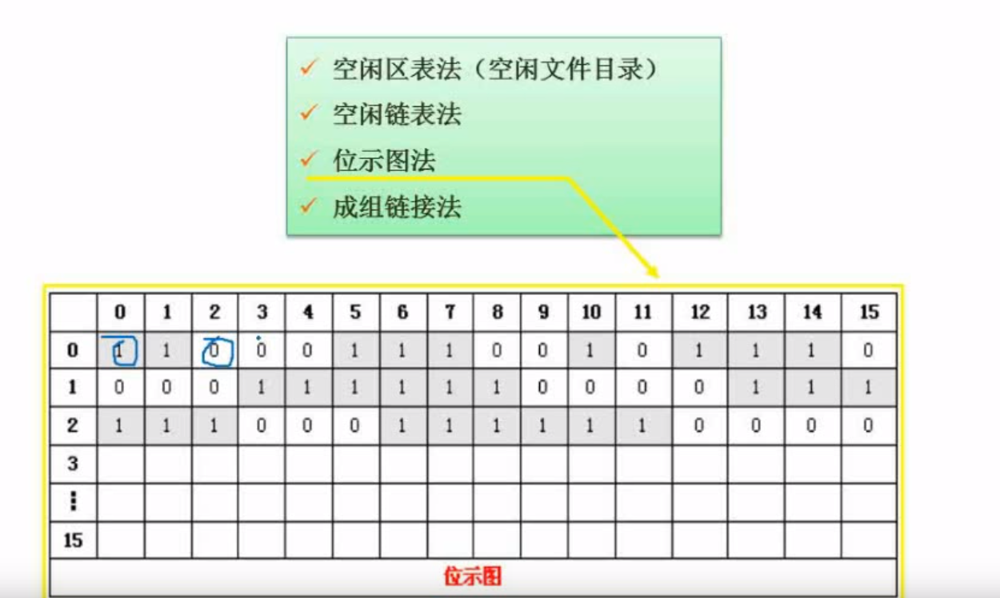

```
第N位置  N 从0开始
第N个字  N 从1开始

字：4195/32 = 131.09 代表前131已经填满 开始在132个字
位：132 * 32 = 4192 在第0位置  那么4195在第3位置 下图解释
```

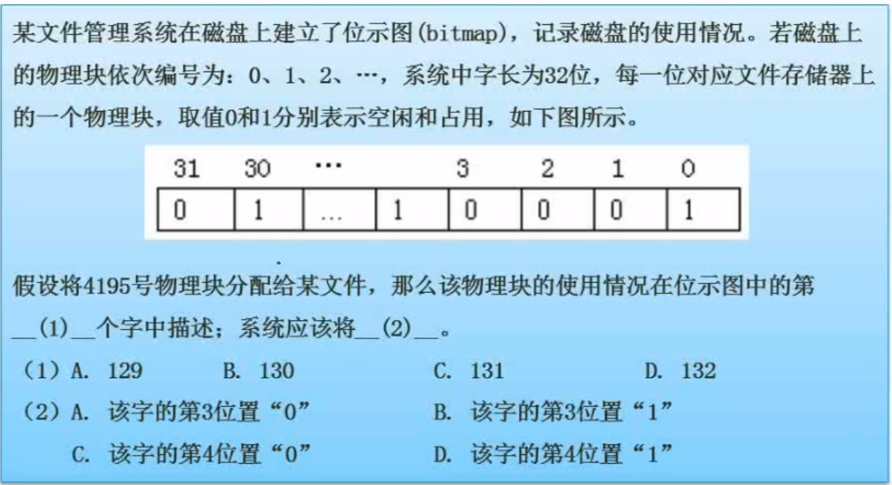


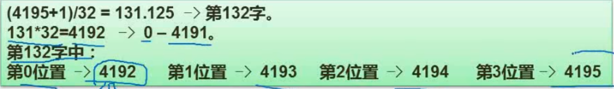

### 数据传输控制方式

```
程序控制方式: Cpu主动询问外设是否处理完毕 效率低
程序中断方式: 外设处理完毕主动提出中断请求 效率较高
DMA方式: 直接内存访问,cpu介入低 主要又DMA控制器处理 效率高
```
### 虚设备与Spooling技术

```
在硬盘上开通缓冲,将要处理的作业按照队列排列工作. 可视队列的硬件实现
```
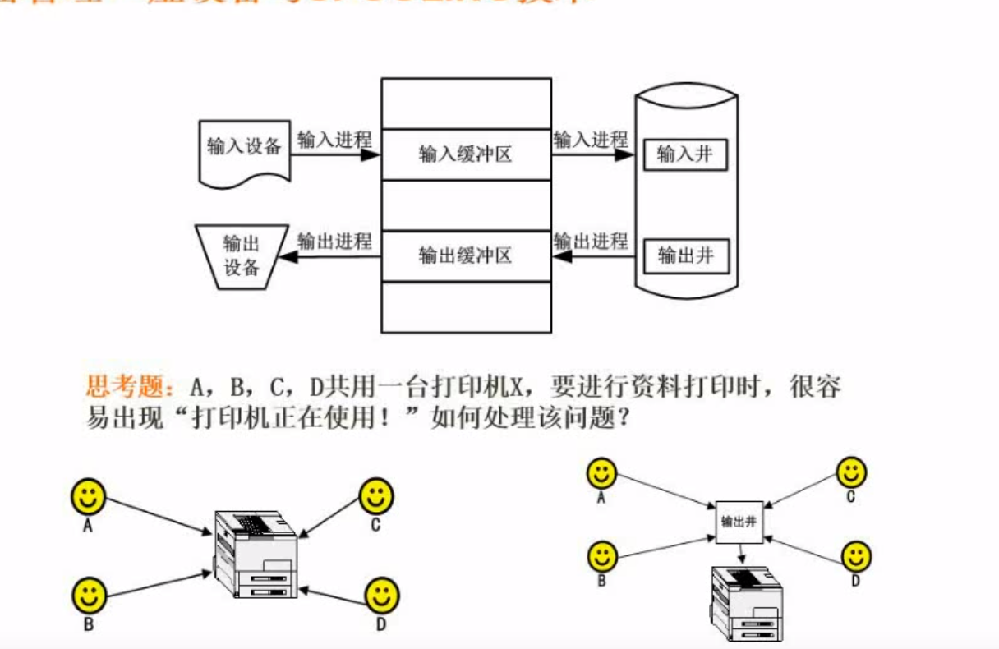

### 微内核操作系统

```
用户态的破坏不影响整个系统运行 安全性,可靠性高。(鸿蒙OS)
```
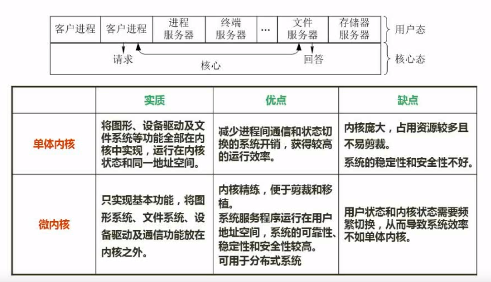
