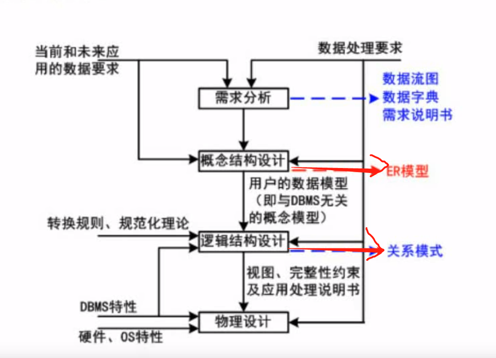
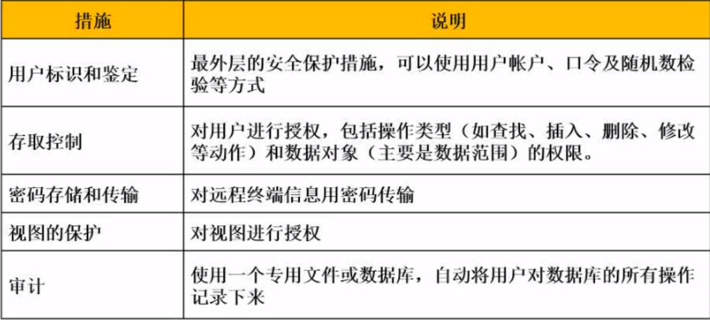
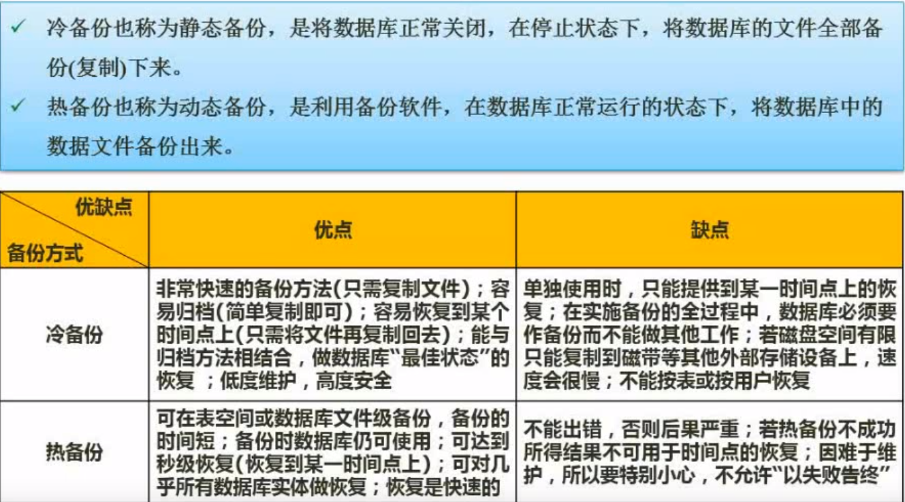

 ## 数据库 (重要)brower-plus
- 数据库模式
- ER模型brower-plus
- 关系代数与元组演算(重要)
- 规范化理论
- 并发控制
- 数据库完整性约束
- 分布式数据库
- 数据仓库与数据挖掘

### 数据库模式

[数据库模式（三级模式+两级映射）](https://blog.csdn.net/mcb520wf/article/details/91047683)
- 三级模式
```
用户级--> 外模式(反映了数据库系统的用户观)
概念级--> 概念模式（反映了数据库系统的整体观）
 物理级 --> 内模式（反映了数据库系统的存储观）
```

- 二级映射
```
模式/内模式的映像：实现概念模式到内模式之间的相互转换。
外模式/模式的映像：实现外模式到概念模式之间的相互转换。
```


### 数据库设计



### ER模型


```
1:1联系 可把联系合并到其中一个表 转化为2个关系模式
1:n联系 课把联系合并1的表中 如员工-部门 转化为2个关系模式
m:n联系 需要单独把联系抽取为一个关系模式  转化为3个关系模式
```


### 关系代数
```
并: S1与S2相同部分
交: S1与S2全部集合
差: S1-S2 => S1中去除S2与S1相同的部分
```

```
笛卡尔积: S1与S2笛卡尔积=> S1每一行与S2每一行组合 共有Row(S1) * Row(S2) 行记录
投影: 相当于SQL语句 select Sno, Sname from S1 中指定Sno,Sname
选择: 相当于SQL语句 select *from S1 where Sno = No0003 中的where语句
```


```
连接: 相当于inner join on S1.xxx = S2.xxx  结果集中列只保留一项(笛卡尔积全部保留)
```


### 规范化理论
- 函数依赖
```
函数依赖： 加入f(x) = x; x能确定唯一的一个f(x); f(x)没法确定x  那么称为函数依赖
部分函数依赖: (学号,课程号) -> 姓名 那么学号或者课程号都是部分函数依赖
传递函数依赖: 学号 -> 姓名 -> 性别  如果学号能确定姓名 姓名能确定性别 那么学号能直接确定性别
```


- 键
```
(学号,姓名) - > 性别
超键: 学号,姓名  唯一标识元组 学号能确定性别 姓名能确定性别
候选键： 学号   超键之上取出冗余键  学号能确定性别就不需要姓名了 去除姓名
主键：在多个候选键中选择一个作为主键
外键：指向其他表
```


- 求候选码实例


- 范式

[数据库设计范式](https://www.cnblogs.com/knowledgesea/p/3667395.html)
```
第一范式：当关系模式R的所有属性都不能在分解为更基本的数据单位时，称R是满足第一范式的，简记为1NF。满足第一范式是关系模式规范化的最低要求，否则，将有很多基本操作在这样的关系模式中实现不了。
         既每个属性都是原子性 不出现一个项包括好几个属性的情况

第二范式：如果关系模式R满足第一范式，并且R得所有非主属性都完全依赖于R的每一个候选关键属性，称R满足第二范式，简记为2NF。
         既(学生,课程) -> 该成绩  而学生不能确定成绩 课程也不能确定成绩

第三范式：设R是一个满足第一范式条件的关系模式，X是R的任意属性集，如果X非传递依赖于R的任意一个候选关键字，称R满足第三范式，简记为3NF.
         既不出现A->B-C的情况
```


```
题1:不属于第三范式有两种情况: 未达到第三范式(存在部分函数依赖) 或者 不符合第三范式(存在传递函数依赖)
题中部门表中的部门号能确定所有属性. 不需要组合候选码,因此达到了第二范式
因而只能选C
题2: 需要得到表4的结构需要在表3员工表添加职工-部门的联系 选D
题3: 通过观察表4 职工号可从表3得到 姓名可从表3得到  部门名课程职工-部门的联系中得到 月销售额需要得到商品（得到价格 名称）以及卖出数量 和 每天卖出的量 因此选A
```


- 依赖分解
```
依赖分解：假设R(A,B,C)存在 A->B B->C  那么分割表为(AB) 与 (BC) 为无损分解  而(AB) (AC)是有损分解  无法重新链接回原表
```


1. 列表法


2. 代表法
```
通过R1与R2的得到的交集A  R1-R2的差B1 R2-R2的差B2 如果A->B1 或者A->B2在原关系模式中 则为无损分解 否则有损
```


### 并发控制
1. 事务
```
原子性: 整个事务中的所有操作，要么全部完成，要么全部不完成，不可能停滞在中间某个环节。事务在执行过程中发生错误，会被回滚（Rollback）到事务开始前的状态，就像这个事务从来没有执行过一样。
一致性: 在事务开始之前和事务结束以后，数据库的完整性约束没有被破坏。
隔离性: 隔离状态执行事务，使它们好像是系统在给定时间内执行的唯一操作。如果有两个事务，运行在相同的时间内，执行 相同的功能，事务的隔离性将确保每一事务在系统中认为只有该事务在使用系统。这种属性有时称为串行化，为了防止事务操作间的混淆，  必须串行化或序列化请 求，使得在同一时间仅有一个请求用于同一数据。
持久性：在事务完成以后，该事务所对数据库所作的更改便持久的保存在数据库之中，并不会被回滚。
```

2. 并发产生的问题
```
丢失更新,不可重复读,读到脏数据
```
3. 封锁协议

[数据库中的锁机制和封锁协议](https://blog.csdn.net/u011244839/article/details/74454933)
```
X锁: 排它锁 也称为写锁
S锁: 共享锁 也称为读锁
```

- 一级封锁协议
```
一级封锁协议是指，事务T在修改数据R之前必须先对其加X锁，直到事务结束才释放。一级封锁协议可以防止丢失修改，并保证事务T是可恢复的。
既更新数据前先加写锁
```

- 二级封锁协议
```
二级封锁协议是指，在一级封锁协议基础上增加事务T在读数据R之前必须先对其加S锁，读完后即可释放S锁。二级封锁协议出防止了丢失修改，还可以进一步防止读“脏”数据。
既在一级封锁协议的基础上. 读数据先加读锁 读完立即释放读锁
```

- 三级封锁协议
```
三级封锁协议是指，在一级封锁协议的基础上增加事务T在读数据R之前必须先对其加S锁，直到事务结束才释放。三级封锁协议出防止了丢失修改和读“脏”数据外，还可以进一步防止了不可重复读。
既在一级封锁协议的基础上. 读数据先加读锁 等事务结束再释放读锁(与二级封锁协议释放时间点不同)
```
- 两段锁协议
```
两段锁协议：是指所有的事务必须分两个阶段对数据项加锁和解锁。即事务分两个阶段，第一个阶段是获得封锁。事务可以获得任何数据项上的任何类型的锁，但是不能释放；第二阶段是释放封锁，事务可以释放任何数据项上的任何类型的锁，但不能申请。
```

### 数据库完整性
```
实体完整性约束: 体现在主键上不能为空 不能重复等 必须按照主键的要求输入
参照完整性约束: 体现在外键设置上.按照外键的约束输入
用户自定义完整性约束: 体现在用户自定义约束上 比如男设置为1 女设置为0等
```

###  数据库安全


### 数据备份



### 数据库故障与恢复


### 反规范化技术


