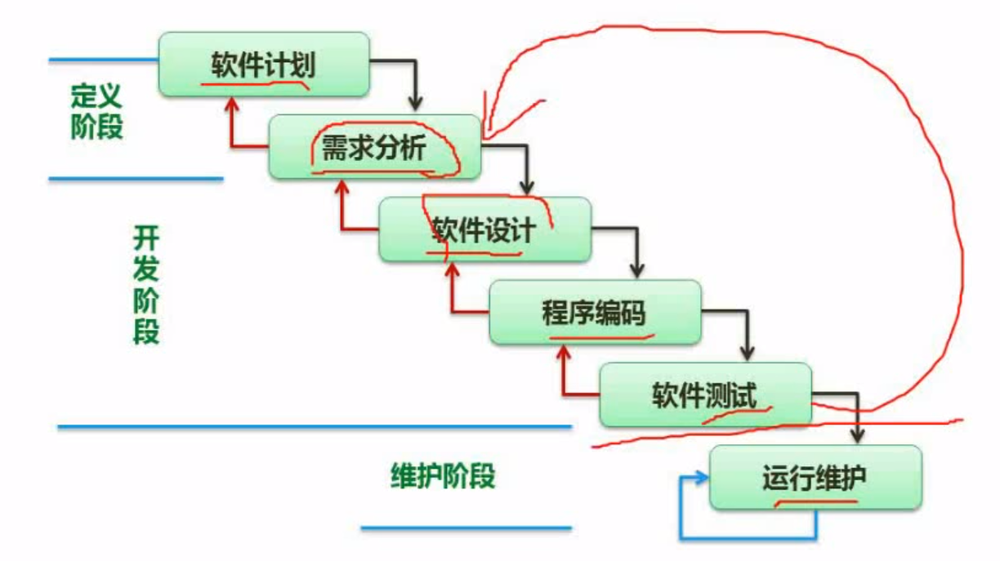
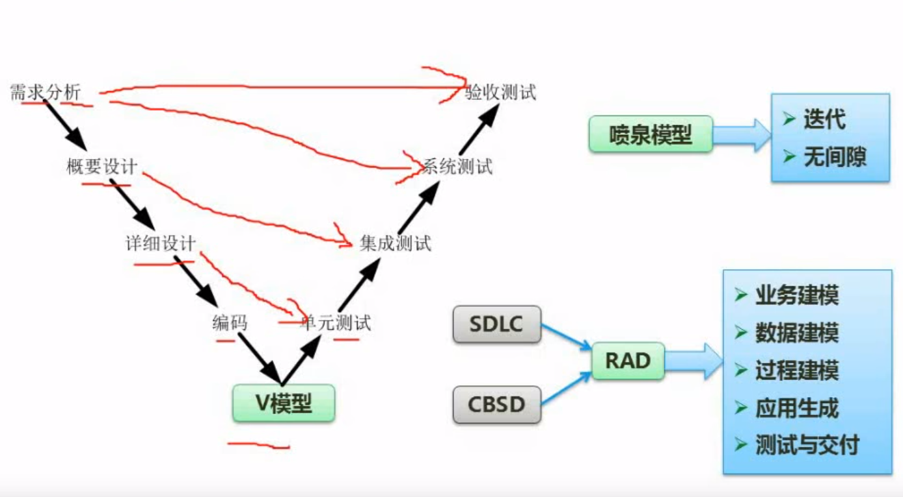

## 软件工程导论

### 瀑布模型

```
适用于需求明确,二次开发
缺点：开发过程中需求不明确容易推翻已编码设计的过程
```



### 原型模型

```
构建一个简易的系统（Demo）给用户,获取用户的需求
```
### 增量模型

```
优先开发重要的部分给用户使用.在逐步添加其他功能
```
### 螺旋模型

```
以风险为驱动,有利于防范风险
```

### V模型

```
V模型强调测试贯穿开发过程.需求分析阶段需要写验收测试与系统测试。 概要设计阶段需要写模块之间的集成测试。详细设计阶段需要写模块的单元测试。
```


