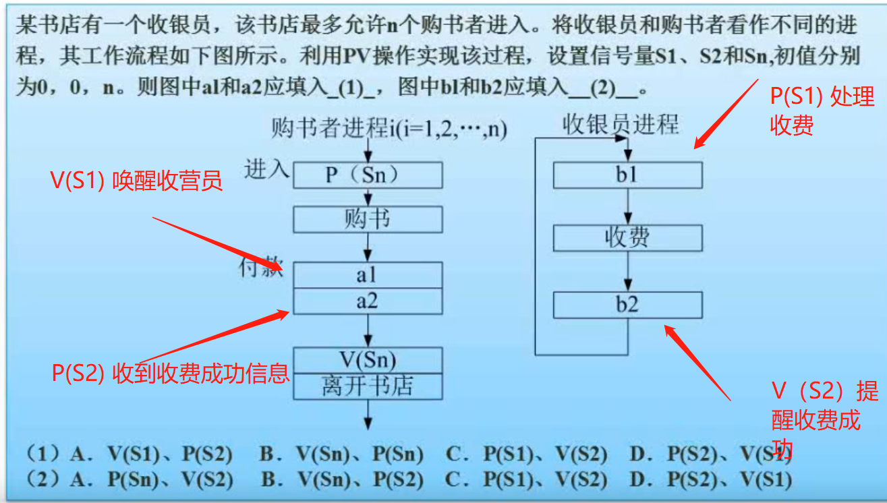
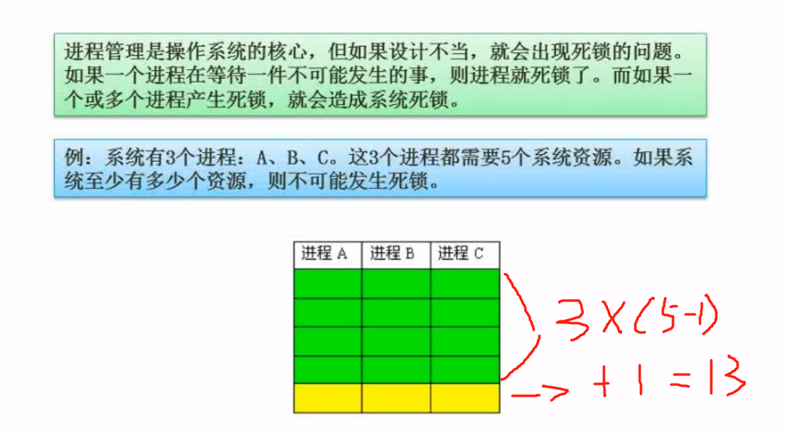
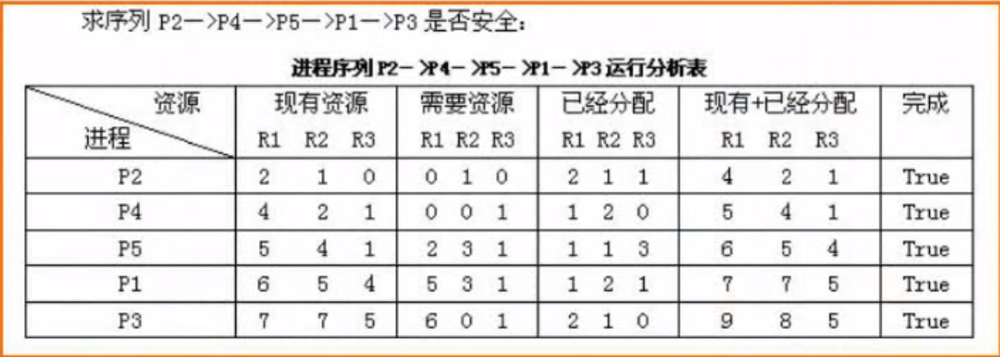
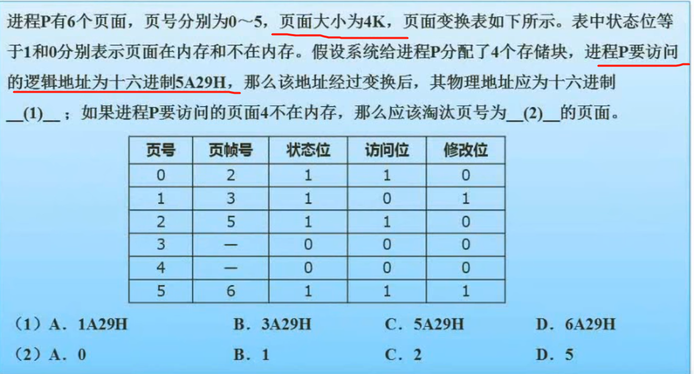
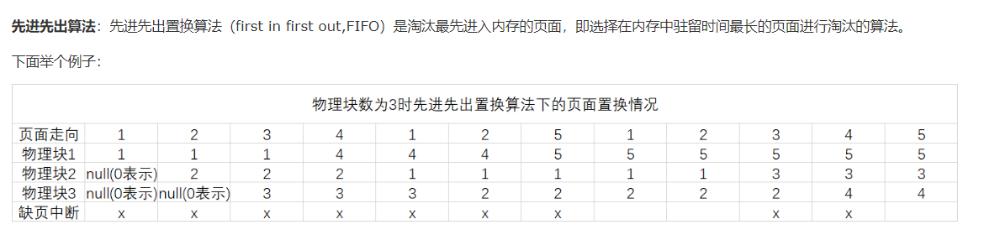
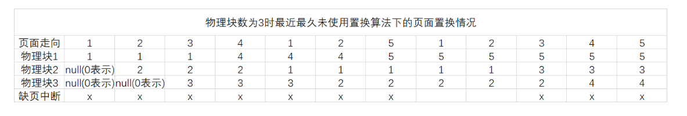
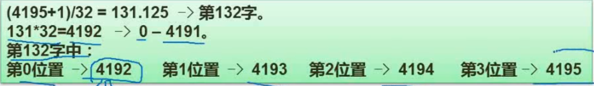

# 软件设计师笔记 #

## 计算机组成原理与体系结构 （上午题6分）

- 数据的表示
- 计算机结构
- Flynn分类法
- CISC与RISC
- 流水线作业
- 存储系统
- 总线系统
- 系统可靠性分析
- 校验码


###  数据的表示

* 进制计算


* 十进制转其他进制


* 原码 反码 补码


- 正数
```
原码 = 反码 = 补码
```

- 负数
```
反码 = 符号位不变 其他位取反
补码 = 反码 + 1
```

- 移码
```
移码：为了数字轴上美观，改变补码的符号位。使正数在右边，负数在左边。
```

- 数值范围


- 浮点数计算

```
对大阶--->尾数计算--->结果格式化（小数点前只能有一位数字）
```


### 计算机结构


### Flynn分类法
```
S:单
M:多
I:指令流
D:数据流
MISD:多指令流单数据流不切实际
```


### CISC与RISC

```
CISC时间较早,用于定制化计算机（如天气预报计算机）数量较多,使用频率差别大,可变长格式,生产周期长,寻址种类多
RISC可视为当代计算机,大部分操作针对寄存器操作,只有Load/Store操作内存, 数量较少（计算机通用）,使用频率差别小,定长格式,流水线生产,寻址种类少
```


### 流水线作业
```
流水线作业是在程序执行时多条指令重叠操作的一种准并行处理实现技术
利用各个部件同时处理针对不用指令而言,可同时为执行多条指令得不同部分
提交利用率与执行速度
如下图介绍
```


- 流水线执行时间计算
```
问题：若指令流水线把一条指令分为取指、分析和执行三部分，且三部分的时间分别是
t取指=2ns ，t 分析=2ns，t 执行=1ns。则100 条指令全部执行完毕需多少时间
```
1. 理论公式计算(百分之八十)
```
理论公式：根据图中描述,总时间片段 = 第一个指令的指令时间 + （n-1）条指令的执行时间* ▲t（该指令中执行时间最大的部分）
==> （t1+t2+t3+t2...+tk） + (n-1)*▲t
该题计算公式为 (2+2+1) + (100-1)*2 = 5 + 108 = 203
```
2. 实践公式计算(百分之二十)
 ```
 实践公式：（（每条指令的分割成的份数） + （n-1）份 ） * ▲t（该指令中执行时间最大的部分）
 ==> （k + n-1)*▲t
 该题计算公式为 （3 + 100 - 1） * 2 = 102 * 2 =204
 ```


- 流水线吞吐率计算


- 流水线加速比计算


- 流水线的效率

```
下图大概意思为：阴影面积/总面积 = 流水线段总的时空区之比
```


### 存储系统


- Cache概念
```
Cpu向Cache要数据,当存在称为命中.当不存在则称为未命中，则从主存中调取数据,并且放入Cache中
```


- 局部性原理

```
  局部性原理是指计算机在执行某个程序时，倾向于使用最近使用的数据。局部性原理有两种表现形式：时间局部性和空间局部性。

  时间局部性是指被引用过的存储器位置很可能会被再次引用，例如：重复的引用一个变量时则表现出较好的时间局部性

  空间局部性是指被引用过的存储器位置附近的数据很可能将被引用；例如：遍历二维数组时按行序访问数据元素具有较好的空间局部性
```

- 主存分类


- 主存编址

```
内存地址从AC000H到C7FFFH，共有（）K个地址单元，如果该内存地址按字（16bit）编址，由28片存储器芯片构成。
已知构成此内存的芯片每片有16K个存储单元，则该芯片每个存储单元存储（）位
```
```
地址大小：C7FFFH（最后的H只是代表为16进制） - AC000H => C800H - AC000H = 1C00H
```

```
地址大小：C*16*16*16*16（3次方） + 1*16*16*16*16（4次方) = 49152 + 65535 = 114687
114687 / 1024 = 112(K)

存储单元存储位：（112k * 16bit） / （28 * 16K） = 1792 / 448 = 4 bit

```
- 磁盘结构与参数


```
假设某磁盘的每个磁道划分成11个物理块，每块存放1个逻辑记录。逻辑记录R0，R1，…，R9，R10存放在同一个磁道上，记录的存放顺序如下表所示
```


1. 最长时间
```
最长时间 = R0处理需要的时间（首次直接访问） + 其他块需要的时间（需要转动最长的时间）
        ==>  6 + (30 + 6) * 10 = 366
```


2. 最短时间

```
最长时间 = 每块处理完时间刚好是最少,不需要转动
        ==>  （6） * 11 = 66
```


### 总线系统

```
总线：外部总线, 内部总线, 系统总线
系统总线：数据总线, 地址总线, 控制总线
```

### 系统可靠性分析

1. 串联系统可靠性分析

```
R 代表可靠率  串联系统可靠性通过相乘得到结果.既 R1的可靠率 * R2的可靠率 * ... *Rn = 系统可靠率R
```


2. 并联系统可靠性分析

```
R 代表可靠率  并联系统可靠性通过计算1 - 同时失效的概率.因为该系统只要有一条路能通,便可用. 只有全部不通,系统才失效
既 1 - (R1失效率* R2失效率 *R3失效率 * ... * Rn失效率) = 系统可靠率R
```


3. 可靠率题目
4.
```
下图中总体为串联系统,局部并联系统
既 R  = R1 * R2 *R3
R1 = R01
R2 = 1 - (1-R02)的三次方
R3 = 1 - (1-R03)的两次方
```


### 校验码  (基本必考)

- CRC(循环冗余校验)

[CRC校验原理及步骤](https://blog.csdn.net/d_leo/article/details/73572373)

CRC校验码计算示例：
现假设选择的CRC生成多项式为G（X） = X4 + X3 + 1，要求出二进制序列10110011的CRC校验码。下面是具体的计算过程：

①将多项式转化为二进制序列，由G（X） = X4 + X3 + 1可知二进制一种有五位，第4位、第三位和第零位分别为1，则序列为11001

②多项式的位数位5，则在数据帧的后面加上5-1位0，数据帧变为101100110000，然后使用模2除法除以除数11001，得到余数。


③将计算出来的CRC校验码添加在原始帧的后面，真正的数据帧为101100110100，再把这个数据帧发送到接收端。

④接收端收到数据帧后，用上面选定的除数，用模2除法除去，验证余数是否为0，如果为0，则说明数据帧没有出错。


- 海明校验法

[海明校验法](https://blog.csdn.net/louyxlovess/article/details/62037900)

```
海明校验法中 校验码存放在2^n位置 也就是1、2、4、8…. 存在公式 2^r ≥ k+r+1  能正确生成海明校验码
其中r为校验位 ，k为信息位 信息位是已知的
```

例如：二进制码1011 求它的海明编码 步骤如下：

1、首先确定信息位，也就是1011了，那么随之K的长度也就知道了是4位

2、确定校验码是几位 根据上述公式我们去试最接近而且满足条件的值，1011的校验位是3，也就是r=3，这样刚好满足了条件

3、确定了校验位的位数之后就是来确定校验位的值以及分配校验位了

首先来看分配校验位： 一般来说校验位都是放在2^n的位置处，也就是1、2、4、8….

其次就是确定分组（也就是确定校验位的值）

通过初步的解题我们知道了校验位+信息位一共是7位，那么我们首先来画一个表，分别把这些数据填进去


注释： 我分别把七个位置用1~7来表示了 在填写信息为的时候也要把高位的数据填到高的位置 ，例如1011 就要类似图中的填法

确定校验位的分组原则：

1.每个位置的校验位确定： 要想校验第几位 （i） 那么i就等于校验位所在位置的加和 举个简单的例子，加入我要校验第3位，那么3=2^0 + 2^ 1 也就是3 由第一个和第二个校验位来校验，照这样的算法，以此类推，我们就可以知道每个位置都需要哪个校验位来校验了


按上述方法分配好后，我们已经明确的知道了每个位置都需要利用哪些位置来校验，下面也是关键的一步了

我们要把这些数据汇总起来，也就是每个校验位都校验了哪些位置，就分别把这些位置的值按亦或计算（也就是相同的值就为0 ，不相同时就取1） 这样就得到了每个校验位的值了

下面我们来看看，每个校验位都分别校验了哪些位置 ：


由此表可以看出对于校验位所要校验的位置的，已经确定了，余下的就是计算检验位的值了，（利用异或运算）
R1=0⊕1⊕1⊕1=>1;
R2=0⊕1⊕0⊕1=>0;
R3=0⊕1⊕0⊕1=>0;
除去有值得位其余为用零补足
位置：1 2 3 4 5 6 7
信息位： r r 1 r 1 0 1
补足后：0 0 1 0 1 0 1

可得到r1 r2 r3 的值分别为 1,0,0

到此位置，我们就求出了校验位的值，同时海明码也就出来了


## 操作系统基本原理   (上午题7分)

- 进程管理
- 存储管理
- 文件管理
- 作业管理  （考的少）
- 设备管理  （考的少）
- 微内核操作系统

### 进制管理
- 进制状态转换图


- 前趋图


- PV操作




- PV操作-前趋图


- 死锁

```
不用发生死锁的资源最小个数 = （每个进程需要的系统资源-1） * 进程数量 + 1
```


- 银行家算法


```
根据计算,图中剩余资源数为2,1,0. 各进程之间还需要的资源数下图表示
由图中可观察只有P2能满足分配,既首先分配给P2
当P2执行完毕回收资源,分配前已有的资源（2,1,0）加上P2占用的资源释放(2,1,1) = 当前能分配的资源（4,2,1）
继续寻找下一个能分配的进程,并回收进制占用的资源 直到所有进制分配完毕.形成安全序列
答案选B
```




### 存储管理

- 分区存储组织

```
首次适应算法: 找到首个满足分配的空间便进行切割分配
最佳适应算法: 找到满足分配的空间且切割后剩余空间最小 缺点:空间被切割后剩余的小空间如果无法满足分配,产生的碎片过多
最差适应算法: 找到满足分配的空间且该空间在满足分配的空间中最大
循环首次适应算法: 从下一个位置找到首个满足分配的空间便进行切割分配,最尾连接最头

```


- 页式存储组织 (内存分页)

```
页式存储组织中逻辑地址转换为物理地址通过页表中的页号寻找块号,页内地址作为物理地址的后半部分,物理地址中前半部分需要通过页号得到块号.两者拼接得到物理地址

```


[页式存储组织题目](https://wenku.baidu.com/view/d5ae990753ea551810a6f524ccbff121dd36c5eb.html)

```
下图由题目可知:页面大小为4K 既2^12 = 4K。
由逻辑地址: 5A29H = 0101 1010 0010 1001 前4位 0101 为页号5, 后12位为页内地址,也为物理地址的后半部分

根据表中可知 页号5块号为6 既 物理地址为 0110 1010 0010 1001 = 6A29H

进制访的页面P4不为内存中.而系统只给进制分配4个存储块已经用完.则需要替换内存中的页面0,1,2,5 而0,2,5有使用过不能淘汰.则替换1号页面
```



- 段式存储组织 (程序分段)


- 段页式存储组织


- 快表


### 页面置换算法

```
最优算法(OPT) 理论算法,无法实现4
随机算法(RAND)
先进先出算法(FIFO) 会发生抖动
最近最少使用算法(LRU) 不会发生抖动
抖动:指分配页面多的情况效率还不如分配页面少的情况
```

1. 先进先出算法

```
先进先出置换算法（first in first out,FIFO）是淘汰最先进入内存的页面，即选择在内存中驻留时间最长的页面进行淘汰的算法。
```



2. 最近最少使用算法

```
需要置换一页时，选择在最近的一段时间里最久没有使用的页面进行置换
```



3. 页面置换例题

```
规则:页表存放在内存中.查询数据先要查找从页表中查找页号. 通过页号与逻辑地址去内存中查找数据  需要访问2次内存
     指令跨页只会产生一次中断,数据跨页则产生多次中断.

下图题中可知Swap指令占用6个页号,则需要访问12次内存.中断次数为1+2+2 = 5
```


### 文件管理

- 索引管理


```
根据图中可知索引节点有8个 磁盘数据块大小为1K。则每个索引能容纳1024/8 =256。
既第58号物理块存放的是5,187号物理块存放的是(5 + 256) = 261
地址0-4为直接索引 5-6为一级索引 7为二级索引
```


- 文件和树型目录结构


- 空闲存储空间的管理

```
空闲区表法(空闲文件目录) 用一个表记录空闲区域
空闲链表法 用链表的方式把空闲空间记录下来
位示图法 把存储空间划分为很多物理块 用01表示存储情况
成组链表法 用块与链表记录空闲区
```


```
第N位置  N 从0开始
第N个字  N 从1开始

字：4195/32 = 131.09 代表前131已经填满 开始在132个字
位：132 * 32 = 4192 在第0位置  那么4195在第3位置 下图解释
```




### 数据传输控制方式

```
程序控制方式: Cpu主动询问外设是否处理完毕 效率低
程序中断方式: 外设处理完毕主动提出中断请求 效率较高
DMA方式: 直接内存访问,cpu介入低 主要又DMA控制器处理 效率高
```
### 虚设备与Spooling技术

```
在硬盘上开通缓冲,将要处理的作业按照队列排列工作. 可视队列的硬件实现
```


### 微内核操作系统

```
用户态的破坏不影响整个系统运行 安全性,可靠性高。(鸿蒙OS)
```

